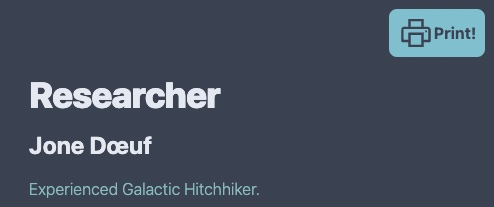
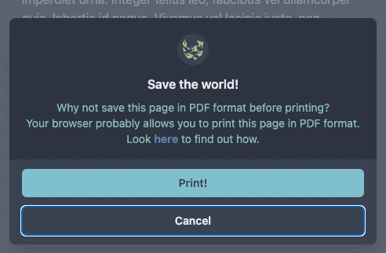
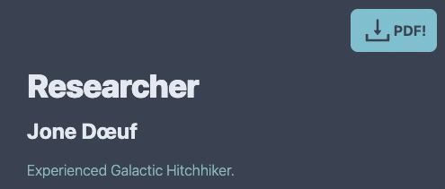

# Nord Theme Resume

This project is a responsive single-page resume built using React and TailwindCSS with ViteJS, designed around the Nord Theme color scheme. You can define the content of the resume via JSON files. 

Depending on whether a link to a PDF file is provided, the UI adjusts to display either a Print button or a Download PDF button.

## Demo

You can see a demo page [here](http://www.studiokris.com/demo-cv), or a customized version [here](http://www.studiokris.com/cv).

## Prerequisites

Before you begin, ensure you have met the following requirements:

* You have installed Node.js and Yarn
* You are familiar with basic terminal commands

## Installing Nord Theme Resume

To install the project, follow these steps:

1. Clone the repository to your local machine:
    ```
    git clone https://github.com/StudioKris/nord-theme-resume.git
    ```
2. Navigate into the cloned repository and install the dependencies:
    ```
    cd nord-theme-resume
    yarn
    ```

## Usage

To start developing and view the webpage in your local development environment, use:
```
yarn dev
```

To build your webpage, use:
```
yarn build
```

This command generates a `dist` folder containing the built website, ready for deployment to any static file hosting service.

## Customization

### Hero Banner 

#### Profile Image

Replace the default image: `public/photo.jpg` to customize your profile image.

*If you change the file name or format, you will need to update the file references.*

#### Image Separator

You can customize the image separator between the Hero Banner and the Body Content by replacing the default image: `public/split.svg`. Inkscape is recommended for editing the SVG file.

*If you change the file name or format, you will need to update the file references.*

### Site Favicon

Change the webpage favicon by replacing the default image: `public/favicon.jpg`

*If you change the file name or format, you will need to update the file references.*

## Print or Download PDF

The behavior and design of the Floating Action Button (FAB) on the webpage will change based on whether or not a URL to a PDF version of your resume is provided in the `pdfUrl` field of the `src/assets/me.json` file.

```json
{
  "pdfUrl": "./cv.pdf",
  "me": {
    ...
  }
}
```

### Print Action
If the `pdfUrl` field does not exist in `src/assets/me.json`, the FAB will enable the user to print the webpage. A popup will also be displayed, prompting the user to consider printing the webpage to a PDF to conserve resources.





### Download PDF Action
If a URL to the PDF is provided in the `pdfUrl` field, the FAB will enable the user to directly download the PDF.



## Content

Profile information is updated via several JSON files. HTML tags are supported in some fields.

### `src/assets/me.json`

This file houses your basic profile information and experience.

- `about.details` supports HTML tags.
- For `languages[].code`, use the [ISO 3166-1-alpha-2 code](https://www.iso.org/obp/ui/#search/code/) for a country.
- `companies` is a dictionary of companies you have worked for. The key is used as a reference in `experiences[].company`.
- `experiences[].missionShort` is a brief job description and `experiences[].missionLong` is a more detailed description. `experiences[].missionShort` will be used to generate a single page Curriculum Vitae in print processing (not implemented yet).
- `experiences[].missions` lists your roles or tasks.
- `experiences[].additionals[]` provides further details about your job.

### `src/assets/competencies.json`

This file holds all your competencies. You can create as many competencies and groups as you wish. The order of entries in the JSON file is maintained.

### `src/assets/skills.json`

This file houses your skills grouped by family. The order of the families is maintained, but the entries of each family are sorted by knowledge level (from 1: Competent to 5: Expert)

## Translation

The webpage can be translated by editing the file: `src/assets/labels.json`

## TODO:
- Finetune design of the printed version of the webpage.
- Include a single page Curriculum Vitae when printing the webpage.

## Contributing to Nord Theme Resume

To contribute to Nord Theme Resume, follow these steps:

1. Fork the repository.
2. Create a new branch: `git checkout -b <branch_name>`.
3. Make your changes and commit them: `git commit -m '<commit_message>'`
4. Push to the original branch: `git push origin <project_name>/<location>`
5. Create the pull request.

Alternatively, see the GitHub documentation on [creating a pull request](https://help.github.com/en/github/collaborating-with-issues-and-pull-requests/creating-a-pull-request).

## License

This project uses the `MIT license`.

## Ressource
- https://vitejs.dev/
- https://react.dev/
- https://tailwindcss.com/
- https://www.nordtheme.com/
- https://github.com/crumb1e/tailwind-nord
- https://github.com/lipis/flag-icons
- https://react-icons.github.io/react-icons/
